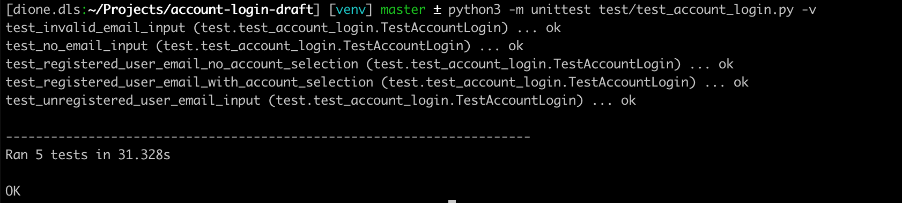

## Testing Perkbox's Multi-account Login Feature

Given the following user story:

    As a user, I want the ability to select an account to login to.
    
And acceptance criteria:

* User enters their email address and clicks the Continue button to see a list of accounts available to them 
* On selecting an account, they are taken to the account’s login page 
* On the login page, the email field should be pre-populated

The task is as follows:

1. List all possible test scenarios for this feature
2. Select two of the scenarios and carry out manual testing on these and to write up a test report for the results of this manual testing
3. Select two of the scenarios and write automated tests for these

## Approach to Solving the Problem

I have opted to write the automated tests using __*Python3*__ with __*unittest*__ as a testing framework. Furthermore, I have used __*Selenium*__ with __*ChromeDriver*__ to test the login feature of the web app.

While it is possible to test the login functionality using different web browsers, this exercise is limited to the use of the 
web app in the Google Chrome web browser.

## The Task

__1. All possible test scenarios for this feature are as follows:__
1. User inputs an unregistered email address in the email field
2. User does not input anything into the email field
3. User inputs an invalid email address in the email field
4. User inputs a registered email address in the email field, user selects a company account to login to
5. User inputs a registered email address in the email field, user __does not__ select any company account to login to

__2. Manual testing of the scenarios yielded the following results:__

| Project Name:  | Perkbox Multi-Account Login |
|----------------|-----------------------------|
| Module Name:   | Login                       |
| Created By:    | Dione Estabillo             |
| Date Created : | 17-02-2019                  |

| Test Scenario | Test Scenario Description                                        | Test Steps                                                                                    | Pre-conditions                                                              | Post-conditions                                  | Expected Result                                       | Actual Result                                  | Status | Notes/Comments |
|-----------|--------------------------------------------------------------|-----------------------------------------------------------------------------------------------|-----------------------------------------------------------------------------|--------------------------------------------------|-------------------------------------------------------|------------------------------------------------|--------|----------------|
| 1         | User inputs an unregistered email address in the email field | 1.) Click on the email field 2.) Enter an unregistered email address 3.) Click on Continue button | 1.) Valid URL: https://app.perkbox.com 2.) Unregistered email: dione@mail.com | Error message: “User is not found”               | “User is not found” should be displayed               | “User is not found” is displayed               | Pass   |                |
| 2         | User inputs an invalid email address in the email field      | 1.) Click on the email field 2.) Enter an arbitrary value 3.) Click on Continue button           | 1.) Valid URL: https://app.perkbox.com 2.) Arbitrary string: kgVghgea6778     | Error message: “This email address is not valid” | “This email address is not valid” should be displayed | “This email address is not valid” is displayed | Pass   |                |

Alternatively, a spreadsheet of the test report can be viewed in the following link:
<https://docs.google.com/spreadsheets/d/1oxyhUsGOFPBT__0ILHL956DG0gQabOR1553_kD2YkzY/edit?usp=sharing>

__3. Follow the steps below to run the automated tests:__

### Getting Started

Note: Before running the program, please make sure that Python3 is available in your machine and to specifically switch to this version.

Using your command line, clone the repository to your local machine:

```sh
$ git clone git@github.com:dione-dls/account-login.git
```
Switch to the cloned repo and and run the following commands:

```sh
$ python3 -m pip install --user --upgrade pip
$ python3 -m pip install --user virtualenv
```
Create a virtual env by running:

```sh
$ python3 -m virtualenv venv
```
Activate the virtual environment:

```sh
$ source venv/bin/activate
```
Install Selenium and ChromeDriver by running the following commands:

```sh
$ pip3 install selenium
$ pip3 install chromedriver
```

### Running the test

Run this command on your terminal:

```sh
$ python3 -m unittest test/test_account_login.py -v
```
The following illustrates the test results after the automated tests have run:

